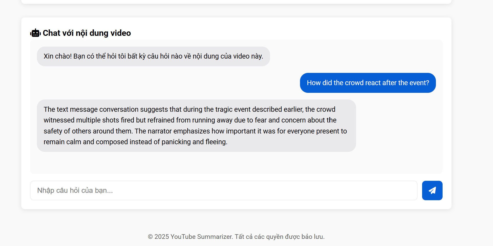

# YouTube Video Chat

YouTube Video Chat is an application that allows users to interact with YouTube video content through captions. This application leverages Retrieval-Augmented Generation (RAG) techniques to answer user questions based on video caption information.

## Features

- Extract captions from YouTube videos
- Automatically generate video content summaries
- Answer questions based on video content
- Support semantic search within captions

## Demo

### Main Interface


### Video Summary


### Question Answering Feature


## Models Used

- **Microsoft Phi-2**: The primary language model used for answering questions
- **BART (philschmid/bart-large-cnn-samsum)**: Model for content summarization
- **Sentence Transformers (all-MiniLM-L6-v2)**: Embedding model for text vectorization

## Installation

### Requirements
- Python 3.8+
- PyTorch
- CUDA (recommended for better performance)

### Installing Libraries

```bash
pip install youtube-transcript-api torch langchain faiss-cpu transformers
```

## Usage Guide

1. Clone this repository:

```bash
git clone https://github.com/your-username/youtube-video-chat.git
cd youtube-video-chat
```

2. Install required libraries:

```bash
pip install -r requirements.txt
```

3. Run the application:

```bash
python main.py
```

4. Enter a YouTube link and start asking questions about the video content

## How It Works

1. **Caption Extraction**: Uses YouTube Transcript API to retrieve captions from videos
2. **Text Processing**: Cleans and prepares text for vectorization
3. **Vectorization**: Converts caption segments into vector embeddings using Sentence Transformers
4. **Vector Database Creation**: Stores vectors in FAISS for efficient searching
5. **Summary Generation**: Uses the BART model to generate video content summaries
6. **Question Answering**: Uses Microsoft Phi-2 combined with RAG to answer questions based on context from captions

## Limitations

- Only works with videos that have captions
- Currently only supports English captions (can be expanded)
- Answer quality depends on the quality of captions and model accuracy

## Contributing

Contributions are welcome! Please create an issue or pull request to improve the application.

## License

MIT
